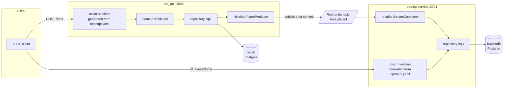

# learningPlanProject

A small sports-betting platform built as a Rust learning project: two independent
microservices communicating over Kafka (Redpanda), each backed by its own Postgres
database, with the HTTP contract for each service defined and generated from OpenAPI.

## Services

| Service            | Responsibility                                              | Port |
|---------------------|--------------------------------------------------------------|------|
| `bet_api`           | Accepts bets, persists them, publishes `BetPlaced` events    | 3000 |
| `trading-service`   | Owns betting events, consumes `BetPlaced`, updates counters  | 3001 |

Shared workspace crates:
- **`contracts`** — the `BetPlaced` event schema shared by producer and consumer.
- **`service-common`** — graceful shutdown, env parsing, and the Swagger/OpenAPI docs
  router, shared by both services.

## Architecture



## Getting started (from a fresh clone)

1. **Start everything (Docker-only workflow):**
   ```bash
   docker compose up --build
   ```
   This builds and starts Postgres, Redpanda (+ console), Adminer, `bet_api`, and
   `trading-service`. OpenAPI code generation runs inside Docker image builds (no local
   `openapi-generator` install required). `betdb` and `tradingdb` are created
   automatically by
   `docker/postgres-init/01-create-databases.sql` on first boot; table creation is
   handled separately by each service's own `sqlx::migrate!` on startup.

   > If you already had a `pg-data` volume from before this init script existed, it
   > won't re-run on it (Postgres only runs init scripts on an empty data directory).
   > Run `docker compose down -v` once to reset, then `docker compose up --build`.

2. **Try it**:
   - Swagger UI: `http://localhost:3000/swagger-ui` and `http://localhost:3001/swagger-ui`
   - Redpanda Console: `http://localhost:8081`
   - Adminer: `http://localhost:8080` (server `db`, user/pass `postgres`)
   ```bash
   curl -X POST http://localhost:3000/bets \
     -H "Content-Type: application/json" \
     -d '{"event_id":"11111111-1111-1111-1111-111111111111","stake":10,"odds":2.0}'
   ```

To stop and clean volumes:
```bash
docker compose down -v
```

## Design decisions & trade-offs

**Why axum, sqlx, rdkafka.** axum is async-first and integrates with `tower`
middleware (`TraceLayer` for request logging); it's also the framework
`openapi-generator` targets, so handlers are trait implementations
(`DefaultApi<AppError>` in `api_impl.rs`) the compiler checks against the spec. sqlx's
compile-time checked queries (`query!`/`query_as!`) catch a typo'd column or type
mismatch at `cargo build` time — no ORM, no reflection, closest thing to JPA schema
validation without the ORM layer on top. rdkafka is the standard async binding over
`librdkafka`, giving real delivery reports (`FutureProducer`/`StreamConsumer`) rather
than fire-and-forget, and Redpanda is Kafka-API-compatible so it's a drop-in local
broker.

**Why contract-first OpenAPI with generated server + client.** `openapi.yaml` is the
single source of truth per service. `openapi-generator` produces trait-based axum
server stubs `ApiImpl` must implement, and a typed `reqwest` client crate per service
(`bet-client`, `trading-client`) other consumers can use without hand-writing DTOs.
Server and client can't silently drift on a field, since both come from the same file.
Trade-off: generation now happens during Docker image build, which adds build time but
removes local toolchain setup.

**Why publish-after-commit, and the outbox/idempotency notes.** In `place_bet`, the
DB insert happens before the Kafka publish, so we never publish a `BetPlaced` event for
a bet that doesn't exist in `betdb`. The trade-off is the classic dual-write problem: if
the process crashes between the DB commit and the Kafka send, the event is lost — today
that's only logged, not retried. A transactional outbox (write the bet and an outbox
row in the same DB transaction, then have a separate relay publish from the outbox)
would close that gap; deliberately out of scope this round. On the consumer side,
`trading-service` assumes at-least-once Kafka delivery (manual offset commit, only
after processing) and protects against redelivery with a `processed_bets` table —
`mark_bet_processed` does `INSERT ... ON CONFLICT DO NOTHING` keyed on `bet_id`, so a
redelivered message is a no-op instead of double-counting.

**Testing strategy.** Tests target what's testable without infrastructure: pure
functions and mapping logic (`validate_place_bet`, `to_model_bet`, `decode_message`,
`parse_u32_env`) get plain unit tests, and `AppError -> HTTP response` mapping gets its
own tests per service (db error -> 500, invalid stake/odds -> 422). There's no
end-to-end integration test against a live Postgres + Redpanda yet — that's the honest
gap if asked.

**Why `tracing`, kept to logs only, this round.** `tracing_subscriber` is wired with an
`EnvFilter` and a structured `fmt` layer; log statements carry structured fields
(`event_id`, `bet_id`, `partition`, `offset`) rather than free text, so they're already
easy to grep/filter. No metrics or distributed tracing export (OpenTelemetry/OTLP,
correlation IDs across the HTTP → Kafka → HTTP hop) yet — a deliberate scope cut to get
structured logging solid first.